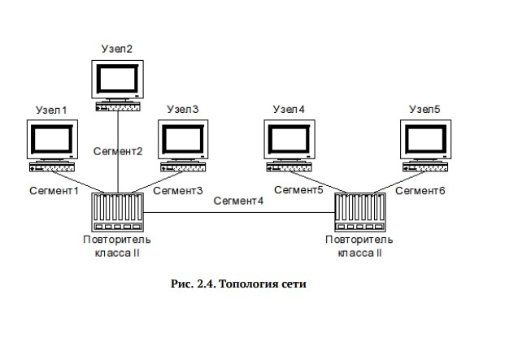

---
## Front matter
title: "Отчет по лабораторной работе №2"
subtitle: "Расчёт сети Fast Ethernet"
author: "Иванов Иван Иванович"

## Generic options
lang: ru-RU
toc-title: "Содержание"

## Pdf output format
toc: true
toc-depth: 2
lof: true
lot: true
fontsize: 12pt
linestretch: 1.5
papersize: a4
documentclass: scrreprt
---

МИНИСТЕРСТВО ОБРАЗОВАНИЯ И НАУКИ РОССИЙСКОЙ ФЕДЕРАЦИИ

ФЕДЕРАЛЬНОЕ ГОСУДАРСТВЕННОЕ АВТОНОМНОЕ ОБРАЗОВАТЕЛЬНОЕ УЧРЕЖДЕНИЕ

ВЫСШЕГО ОБРАЗОВАНИЯ

«РОССИЙСКИЙ УНИВЕРСИТЕТ ДРУЖБЫ НАРОДОВ»

ФАКУЛЬТЕТ ФИЗИКО-МАТЕМАТИЧЕСКИХ И ЕСТЕСТВЕННЫХ НАУК

КАФЕДРА ПРИКЛАДНОЙ ИНФОРМАТИКИ И ТЕОРИИ ВЕРОЯТНОСТЕЙ

**ОТЧЕТ ПО ЛАБОРАТОРНОЙ РАБОТЕ №2**

**Расчёт сети Fast Ethernet**

**Выполнил:** Шихалиева Зурият Арсеновна
**Группа:** НПИбд-02-23

**Преподаватель:** Кулябов Д.С.

Москва

2026

## Цель работы

Целью данной лабораторной работы являлось изучение принципов технологии Ethernet и Fast Ethernet, и практическое освоение методики оценки работоспособности сети, построенной на базе технологии Fast Ethernet.

## Задание

Первым заданием было оценить работоспособность 100-мегабитной сети Fast Ethernet в соответствии с первой моделью, и вторым заданием — в соответствии со второй моделью. Представлена топология сети, которую мы оценивали, и конфигурации.

Рис. 1. Топология сети

## Выполнение лабораторной работы

### Оценка по первой модели
