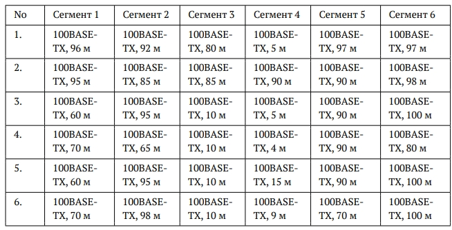
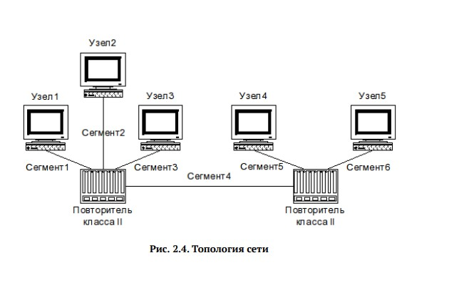
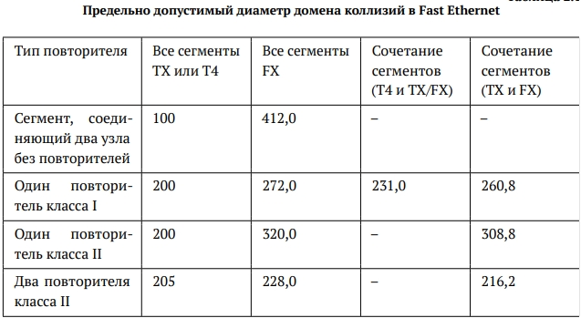
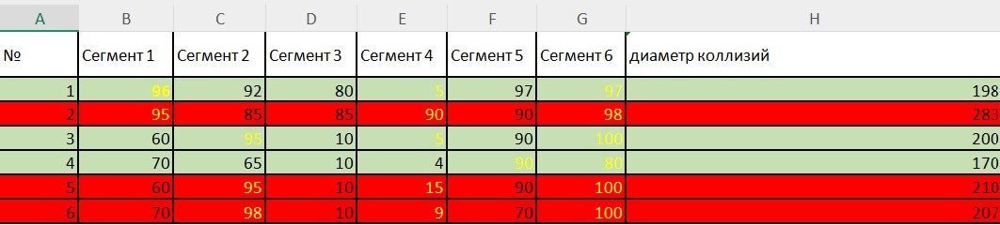
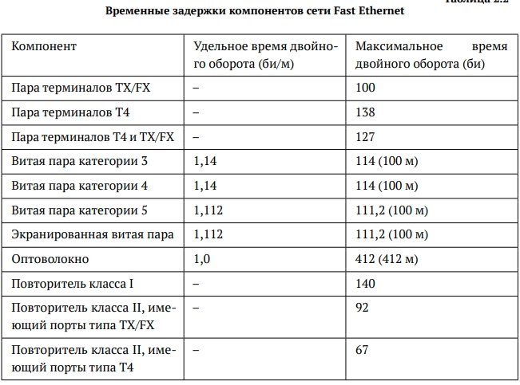
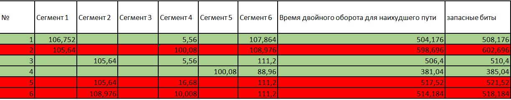

# Задание

Требуется оценить работоспособность 100-мегабитной сети Fast Ethernet в соответствии с первой и второй моделями.

Конфигурации сети приведены на ([рис. @fig-001]). Топология сети представлена на ([рис. @fig-002])

{#fig-001 width=70%}

{#fig-002 width=70%}

# Выполнение лабораторной работы

## Оценка работоспособности сети в соответствии с первой моделью

Оцениваем работоспособность 100-мегабитной сети Fast Ethernet в соответствии с первой моделью.  
Диаметр домена коллизий вычисляется как сумма длин сегментов (расстояние между двумя наиболее удалёнными друг от друга оконечными устройствами).

Рассматриваются конфигурации, где все сегменты TX и присутствует два повторителя класса 2. Исходя из ([рис. @fig-003]) предельно допустимый диаметр домена коллизий будет равен *205 м*. Поэтому нужно найти диаметр домена коллизий для каждой конфигурации и сравнить результат с этим числом.

{#fig-003 width=70%}

В данной топологии сети нужно выбрать наибольшее расстояние из сегментов 1, 2 и 3, сложить с сегментом 4 и прибавить наибольшее расстояние из сегментов 5 и 6

### Расчёты:

Вариант 1:  
96 + 5 + 97 = 198, 198 < 205, значит сеть работоспособна  

Вариант 2:  
95 + 90 + 98 = 283, 283 > 205, значит сеть неработоспособна  

Вариант 3:  
95 + 5 + 100 = 200, 200 < 205, значит сеть работоспособна  

Вариант 4:  
70 + 4 + 90 = 164, 164 < 205, значит сеть работоспособна  

Вариант 5:  
95 + 15 + 100 = 210, 210 > 205, значит сеть неработоспособна  

Вариант 6:  
98 + 9 + 100 = 207, 207 > 205, значит сеть неработоспособна  

Получается, что по первой модели работоспособными являются сети 1, 3 и 4 ([рис. @fig-004])

{#fig-004 width=70%}

## Оценка работоспособности сети в соответствии со второй моделью

Оцениваем работоспособность 100-мегабитной сети Fast Ethernet в соответствии со второй моделью. Для этого нужно найти наилучшие пути в домене коллизий, определить сегменты. В нашей конфигурации все сегменты 100BASE-TX и используется витая пара категории 5. Время для двойного оборота на сегменте рассчитываем умножая длину сегмента на удельное время двойного оборота, которое равно 1,112 би/м из ([рис. @fig-005]).

Суммируем для каждого варианта полученные значения для всех сегментов наихудшего пути и прибавляем время двойного оборота двух повторителей класса 2, которое равно 92 би для каждого из ([рис. @fig-005]). Также прибавляем время двойного оборота пары терминалов с интерфейсами TX, которое равно 100 би из ([рис. @fig-005]).

{#fig-005 width=70%}

Для учёта непредвиденных задержек к полученному результату добавляем ещё 4 битовых интервала (би). Полученные значения сравниваем с 512 би. Сеть будет считаться работоспособной если время двойного оборота для наихудшего пути не будет превышать 512.

### Расчёты:

Вариант 1: (96 + 5 + 97)*1,112 + 100 + 92 + 92 + 4 = 508,176, 508,176 < 512, значит сеть работоспособна  

Вариант 2: (95 + 90 + 98)*1,112 + 100 + 92 + 92 + 4 = 602,696, 602,696 > 512, значит сеть неработоспособна  

Вариант 3: (95 + 5 + 100)*1,112 + 100 + 92 + 92 + 4 = 510,4, 510,4 < 512, значит сеть работоспособна  

Вариант 4: (70 + 4 + 90)*1,112 + 100 + 92 + 92 + 4 = 470,368, 470,368 < 512, значит сеть работоспособна  

Вариант 5: (95 + 15 + 100)*1,112 + 100 + 92 + 92 + 4 = 521,52, 521,52 > 512, значит сеть неработоспособна  

Вариант 6: (98 + 9 + 100)*1,112 + 100 + 92 + 92 + 4 = 518,184, 518,184 > 512, значит сеть неработоспособна  

Получается, что по второй модели работоспособными являются также сети 1, 3 и 4 ([рис. @fig-006])

{#fig-006 width=70%}

# Выводы

В ходе выполнения лабораторной работы №2 мы изучили принципы технологий Ethernet и Fast Ethernet и освоили методики оценки работоспособности сети, построенной на базе технологии Fast Ethernet.

