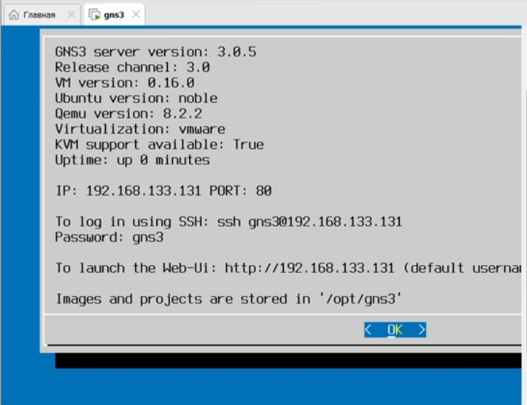
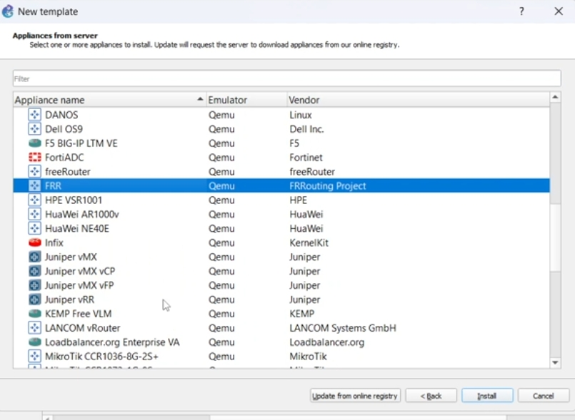
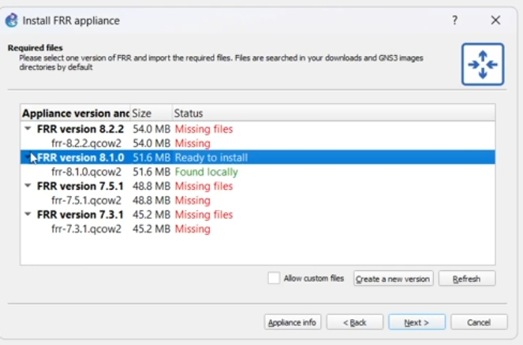
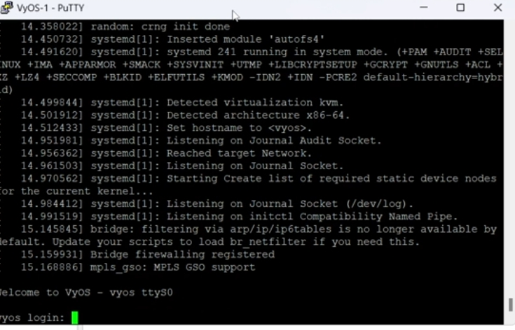
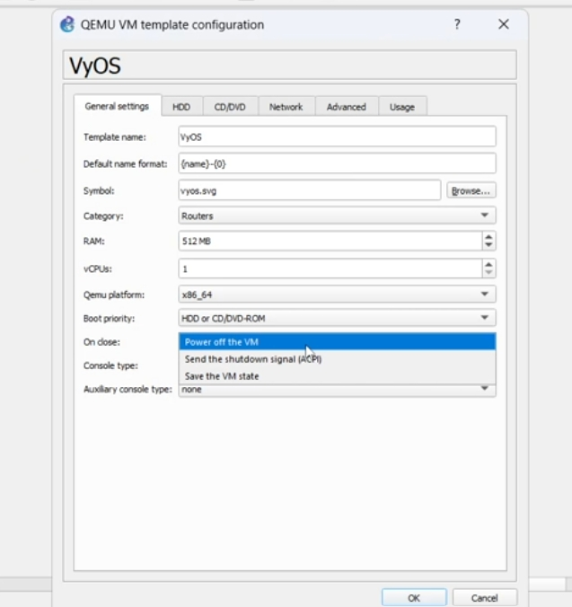

# Цель работы

## Основная цель

Установка и настройка GNS3 и сопутствующего сетевого ПО.

# Выполнение работы

## Запуск GNS3 VM

- Проверка версии сервера  
- Проверка состояния виртуализации  
- Получение IP-адреса для подключения

{ width=80% }

## Подключение клиента к GNS3 VM

- Тип: Remote  
- Порт: 80  
- Пользователь: admin  

{ width=70% }

## Выбор шаблона FRR

{ width=80% }

## Импорт образа FRR

- Использована версия: **8.2.2**
- Образ найден локально
- Статус: Ready to install

{ width=75% }

## Запуск FRR

- Успешная загрузка  
- Готовность к конфигурации маршрутизации

{ width=65% }

## Параметры виртуальной машины FRR

{ width=75% }

## Поиск и выбор образа

- Найден образ **VyOS 1.3.3-qemu**
- Статус: Ready to install

{ width=75% }

## Запуск VyOS

- Успешная загрузка системы  
- Запрос учётных данных  

{ width=70% }

## Параметры шаблона VyOS

- 512 MB RAM  
- 1 vCPU  
- Загрузка с HDD/CD-ROM  

{ width=75% }

# Итоги

## Основные достижения

- Установлены **GNS3** и **GNS3 VM**
- Проверена корректность их взаимодействия
- Импортированы и запущены маршрутизаторы:  
  - **FRR**  
  - **VyOS**
- Подготовлен экспериментальный стенд для следующих лабораторных работ
