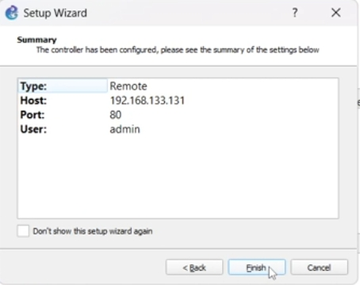
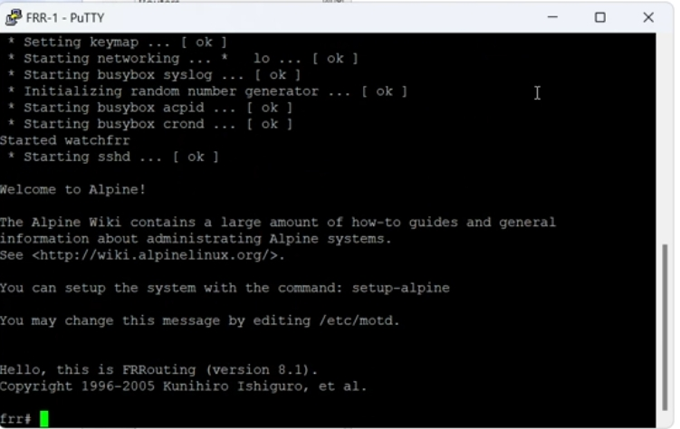
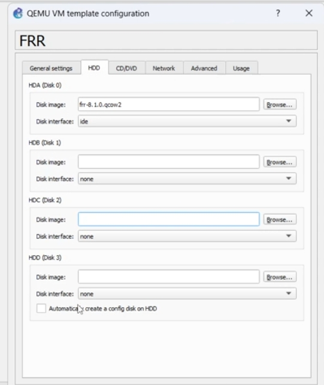
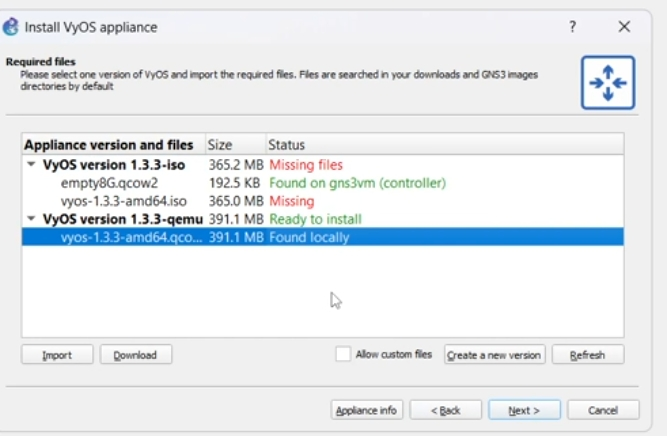

# Цель работы

Установка и настройка GNS3 и сопутствующего программного обеспечения.

# Выполнение

## Установка и настройка GNS3, импорт образов FRR и VyOS

В рамках лабораторной работы были выполнены действия по установке GNS3, запуску GNS3 VM и добавлению образов маршрутизаторов FRR и VyOS.

### Запуск GNS3 VM и проверка состояния

После установки GNS3-all-in-one и GNS3 VM была запущена виртуальная машина. На экране отображены версия сервера, статус виртуализации и сетевые параметры.

{ #fig:401 width=80% }

### Настройка удалённого контроллера GNS3

В клиенте GNS3 добавлен контроллер, работающий на GNS3 VM. Указаны IP-адрес, порт и учётная запись по умолчанию.

{ #fig:402 width=70% }

## Импорт маршрутизатора FRR

Для добавления маршрутизатора FRR был выбран шаблон из списка QEMU-устройств.

{ #fig:403 width=80% }

Затем выбран локально доступный файл образа FRR версии 8.2.2. Его статус изменился на “Ready to install”.

{ #fig:404 width=75% }

После запуска устройства FRR консоль отобразила успешную загрузку системы.

{ #fig:405 width=70% }

### Проверка параметров шаблона FRR

GNS3 корректно создал конфигурационный диск и распознал параметры виртуальной машины.

{ #fig:406 width=75% }

## Импорт маршрутизатора VyOS

Следующим этапом выполнен импорт образа VyOS. Образ версии 1.3.3-qemu был найден локально и готов к установке.

{ #fig:407 width=75% }

После запуска устройства консоль отобразила успешную загрузку и запрос логина.

{ #fig:408 width=70% }

### Проверка параметров шаблона VyOS

GNS3 автоматически назначил характеристики виртуальной машины: 512 МБ RAM, 1 vCPU и корректный режим загрузки.

{ #fig:409 width=75% }

# Заключение

В ходе выполнения работы были достигнуты цели:

- установлены GNS3 и GNS3 VM;
- проверена корректность их работы;
- импортированы и протестированы образы маршрутизаторов **FRR** и **VyOS**.
