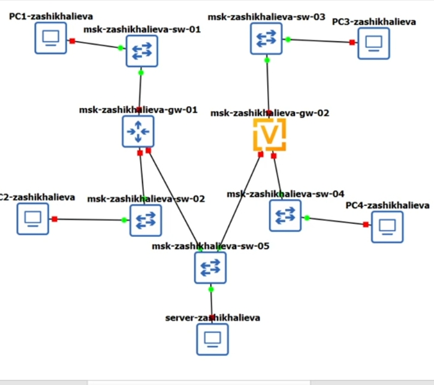
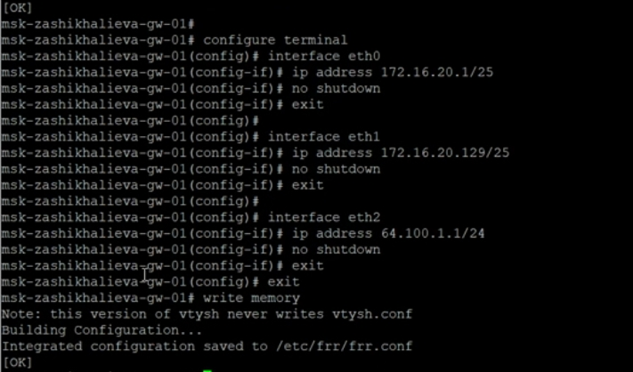
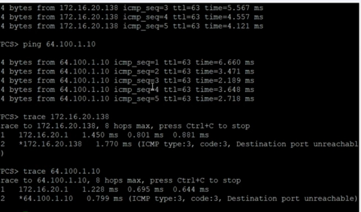
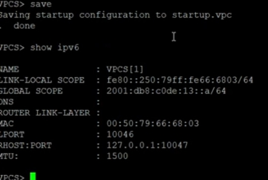
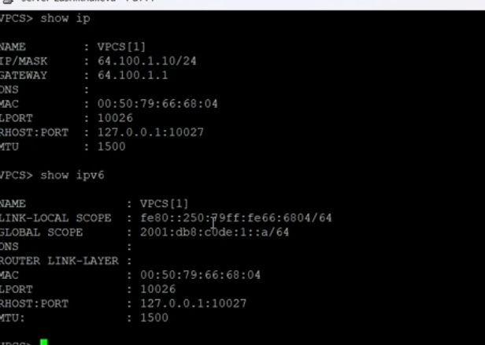
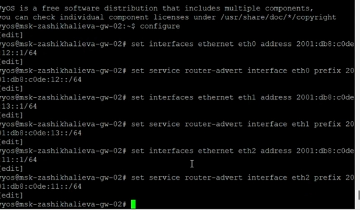
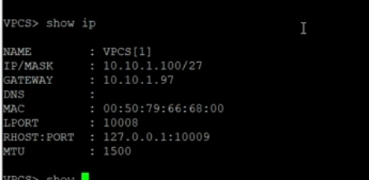
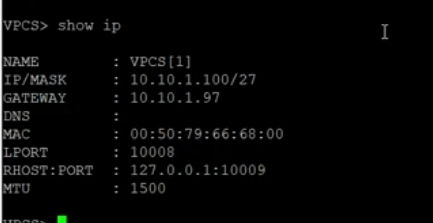
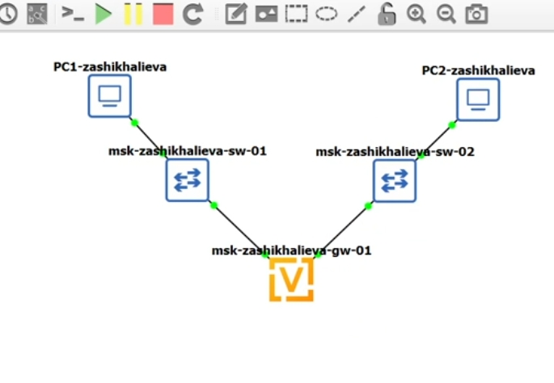
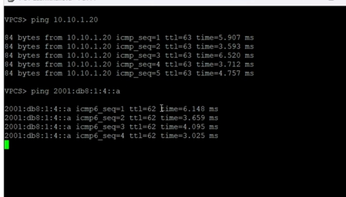

---
## Front matter
lang: ru-RU
title: Сетевые технологии
subtitle: Адресация IPv4 и IPv6. Двойной стек
author:
  - Шихалиева Зурият Арсеновна
institute:
  - Российский университет дружбы народов, Москва, Россия
date: 20 ноября 2025

## Formatting pdf
toc: false
slide_level: 2
aspectratio: 169
theme: metropolis
header-includes:
 - \metroset{progressbar=frametitle,sectionpage=progressbar,numbering=fraction}
---

# Цель работы

## Основная цель

Изучить методы распределения IPv4/IPv6-адресов, разбиение сетей на подсети и настройку двойного стека в виртуальной лабораторной среде.

# Настройка двойного стека адресации IPv4 и IPv6

## Топология стенда

{ width=80% }

## Конфигурация PC1

IPv4: 172.16.20.х  
IPv6: автоматическое назначение SLAAC  
Проверка командой `show ip`

{ width=75% }

## Конфигурация PC2

IPv4: из диапазона 172.16.20.128/26  
IPv6: SLAAC

{ width=75% }

## Интерфейсы FRR

- eth0 — 172.16.20.1/25  
- eth1 — 172.16.20.129/25  
- eth2 — 64.100.1.1/24  

{ width=80% }

## Ping и трассировка

- PC1 → PC2  
- PC1 → Server  

{ width=80% }

{ width=90% }

{ width=90% }

## PC3

Адрес: 2001:db8:c0de:12::/64

{ width=75% }

## PC4

Адрес: 2001:db8:c0de:13::/64

{ width=75% }

## Сервер

IPv6: 2001:db8:c0de:11::/64  
Двойной стек: IPv4 + IPv6

{ width=75% }

## Назначение адресов и RA

{ width=85% }

## Проверка интерфейсов

{ width=70% }

## Ping PC4 → PC3 и Server

{ width=80% }

## ICMPv6-трафик

{ width=90% }

# Самостоятельное задание

## Подсеть 1

- IPv4: 10.10.1.96/27  
- IPv6: 2001:db8:1:1::/64

## Подсеть 2

- IPv4: 10.10.1.16/28  
- IPv6: 2001:db8:1:4::/64

## Таблица адресов

| Устройство | Интерфейс | IPv4 | Маска | IPv6 | Префикс |
|-----------|-----------|------|-------|------|----------|
| gw        | eth0 | 10.10.1.97 | /27 | 2001:db8:1:1::1 | /64 |
| gw        | eth1 | 10.10.1.17 | /28 | 2001:db8:1:4::1 | /64 |
| PC1 | vpcs | 10.10.1.100 | /27 | 2001:db8:1:1::a | /64 |
| PC2 | vpcs | 10.10.1.20 | /28 | 2001:db8:1:4::a | /64 |

## PC1

{ width=75% }

## PC2

{ width=75% }

## Топология

{ width=70% }

## Настройка маршрутизатора

{ width=80% }

## Проверки

{ width=80% }

## Проверки

{ width=85% }

# Итоги работы

## Основные результаты

- Выполнено детальное разбиение IPv4/IPv6-сетей  
- Настроены двойные стеки на ПК и маршрутизаторах  
- Проверена маршрутизация, ARP/ND, ICMPv4/ICMPv6  
- Подтверждена корректная работа сетей и взаимодействие подсетей только через маршрутизатор
