# Цель работы

Изучение принципов распределения и настройки адресного пространства на устройствах сети.

# Разбиение IPv4-сетей на подсети

## Сеть 172.16.20.0/24

### Основные характеристики исходной сети

- Префикс: **/24**
- Маска: **255.255.255.0**
- Адрес сети: **172.16.20.0**
- Broadcast-адрес: **172.16.20.255**
- Число адресов в сети: 2^(32–24) = 2^8 = **256**
- Число адресов узлов: 256 – 2 = **254**
- Диапазон адресов узлов: **172.16.20.1 – 172.16.20.254**

Если рассматривать эту сеть как часть класса B (исходный префикс /16), то число возможных подсетей с префиксом /24:
- Количество подсетей: 2^(24–16) = **256**

### Разбиение на три подсети (126, 62, 62 узла)

Требуемое количество узлов:

- Подсеть 1: 126 узлов → нужно минимум 7 бит для хостов  
  2^7 – 2 = 126 → префикс **/25**
- Подсеть 2: 62 узла → нужно 6 бит  
  2^6 – 2 = 62 → префикс **/26**
- Подсеть 3: 62 узла → тоже **/26**

Размещаем подсети последовательно внутри 172.16.20.0/24 (от меньшего адреса к большему).

#### Подсеть 1 (126 узлов)

- Адрес сети: **172.16.20.0/25**
- Маска: **255.255.255.128**
- Диапазон узлов: **172.16.20.1 – 172.16.20.126**
- Broadcast: **172.16.20.127**
- Число адресов узлов: **126**

#### Подсеть 2 (62 узла)

Оставшаяся часть исходной сети — 172.16.20.128/25. Делим её на две /26.

Первая /26:

- Адрес сети: **172.16.20.128/26**
- Маска: **255.255.255.192**
- Диапазон узлов: **172.16.20.129 – 172.16.20.190**
- Broadcast: **172.16.20.191**
- Число адресов узлов: **62**

#### Подсеть 3 (62 узла)

Вторая /26 из того же диапазона:

- Адрес сети: **172.16.20.192/26**
- Маска: **255.255.255.192**
- Диапазон узлов: **172.16.20.193 – 172.16.20.254**
- Broadcast: **172.16.20.255**
- Число адресов узлов: **62**

## Сеть 10.10.1.64/26

### Характеристики исходной сети 10.10.1.64/26

- Префикс: **/26**
- Маска: **255.255.255.192**
- Адрес сети: **10.10.1.64**
- Broadcast-адрес: **10.10.1.127**
- Число адресов в сети: 2^(32–26) = 2^6 = **64**
- Число адресов узлов: 64 – 2 = **62**
- Диапазон адресов узлов: **10.10.1.65 – 10.10.1.126**

Если считать, что базовая сеть — 10.10.1.0/24, то с префиксом /26 это разбиение на:
- Количество возможных подсетей: 2^(26–24) = **4 подсети**  
  (10.10.1.0/26, 10.10.1.64/26, 10.10.1.128/26, 10.10.1.192/26)

### Выделение подсети на 30 узлов внутри 10.10.1.64/26

Нужно 30 узлов → 2^5 – 2 = 30 → префикс **/27**.

Сеть 10.10.1.64/26 (64–127) делится на две /27:

1. 10.10.1.64/27 (64–95)  
2. 10.10.1.96/27 (96–127)

Выберем первую, с минимальным адресом.

**Искомая подсеть (на 30 узлов):**

- Адрес сети: **10.10.1.64/27**
- Маска: **255.255.255.224**
- Число адресов в подсети: 32
- Число адресов узлов: 32 – 2 = **30**
- Диапазон узлов: **10.10.1.65 – 10.10.1.94**
- Broadcast: **10.10.1.95**

## Сеть 10.10.1.0/26

### Характеристики сети 10.10.1.0/26

- Префикс: **/26**
- Маска: **255.255.255.192**
- Адрес сети: **10.10.1.0**
- Broadcast-адрес: **10.10.1.63**
- Число адресов в сети: 2^(32–26) = 64
- Число адресов узлов: 64 – 2 = **62**
- Диапазон адресов узлов: **10.10.1.1 – 10.10.1.62**

В пределах 10.10.1.0/24 при маске /26 также возможны **4 подсети** (0/26, 64/26, 128/26, 192/26).

### Выделение подсети на 14 узлов

Нужно 14 узлов → 2^4 – 2 = 14 → префикс **/28**.

Сеть 10.10.1.0/26 (диапазон 0–63) делится на четыре /28:

1. 10.10.1.0/28 (0–15)  
2. 10.10.1.16/28 (16–31)  
3. 10.10.1.32/28 (32–47)  
4. 10.10.1.48/28 (48–63)  

Выберем первую.

**Искомая подсеть (на 14 узлов):**

- Адрес сети: **10.10.1.0/28**
- Маска: **255.255.255.240**
- Число адресов в подсети: 16
- Число адресов узлов: 16 – 2 = **14**
- Диапазон узлов: **10.10.1.1 – 10.10.1.14**
- Broadcast: **10.10.1.15**

# Разбиение IPv6-сети на подсети

## Сеть 2001:db8:c0de::/48

### Характеристика исходной сети

Адрес в полной форме:

- 2001:0db8:c0de:0000:0000:0000:0000:0000

Параметры сети:

- Префикс: /48  
- Маска (в двоичном виде): 48 единиц и 80 нулей  
- Часть сети: первые три блокa (hextet) — `2001:0db8:c0de`  
- Диапазон адресов внутри префикса:  
  - минимальный: 2001:db8:c0de:0:0:0:0:0  
  - максимальный: 2001:db8:c0de:ffff:ffff:ffff:ffff:ffff  

В IPv6 нет broadcast-адреса, вместо него используется многоадресная рассылка.  
Однако «краевыми» адресами диапазона считаются показанные выше минимальный и максимальный адрес.

### Разбиение на 2 подсети с использованием идентификатора подсети

Считаем, что для идентификатора подсети используются биты с 49-го по 64-й (четвёртый hextet).  
Добавляем один бит к префиксу: /49. Это даёт две подсети:

1. Подсеть 1:  
   - Адрес сети: 2001:db8:c0de:0000::/49  
   - Диапазон адресов:  
     - от 2001:db8:c0de:0:0:0:0:0  
     - до 2001:db8:c0de:7fff:ffff:ffff:ffff:ffff  

2. Подсеть 2:  
   - Адрес сети: 2001:db8:c0de:8000::/49  
   - Диапазон адресов:  
     - от 2001:db8:c0de:8000:0:0:0:0  
     - до 2001:db8:c0de:ffff:ffff:ffff:ffff:ffff  

Интерпретация: меняется старший бит четвёртого блока (0 → первая подсеть, 8 → вторая подсеть), то есть мы используем именно поле идентификатора подсети.

### Разбиение на 2 подсети с использованием идентификатора интерфейса

Теперь внутри одной из /64-подсетей сделаем разбиение по битам идентификатора интерфейса.  
Сначала выберем одну /64 внутри исходного /48, например:

- 2001:db8:c0de:1::/64  

В этой сети биты 65–128 образуют идентификатор интерфейса.  
Добавим один бит к префиксу: получим две /65-подсети, отличающиеся старшим битом интерфейсного идентификатора:

1. Подсеть A (старший бит интерфейсного ID = 0):  
   - Адрес сети: 2001:db8:c0de:1:0000:0000:0000:0000/65  
   - Краевые адреса:  
     - минимальный: 2001:db8:c0de:1:0:0:0:0  
     - максимальный: 2001:db8:c0de:1:7fff:ffff:ffff:ffff  

2. Подсеть B (старший бит интерфейсного ID = 1):  
   - Адрес сети: 2001:db8:c0de:1:8000:0000:0000:0000/65  
   - Краевые адреса:  
     - минимальный: 2001:db8:c0de:1:8000:0:0:0  
     - максимальный: 2001:db8:c0de:1:ffff:ffff:ffff:ffff  

Интерпретация: префикс /64 остаётся одним и тем же с точки зрения глобального маршрутизирования (одно значение идентификатора подсети `…:1:`), но мы «одалживаем» один бит из зоны интерфейсного ID и превращаем его в дополнительный бит префикса. Так получаются две меньшие подсети /65 внутри одной «классической» /64-подсети.

## Сеть 2a02:6b8::/64

### Характеристика исходной сети

Адрес в полной форме:

- 2a02:06b8:0000:0000:0000:0000:0000:0000

Параметры сети:

- Префикс: /64  
- Маска: 64 единицы и 64 нуля  
- Часть сети: первые четыре блока — `2a02:06b8:0000:0000`  
- Диапазон адресов внутри префикса:  
  - минимальный: 2a02:6b8:0:0:0:0:0:0  
  - максимальный: 2a02:6b8:0:0:ffff:ffff:ffff:ffff  

Это «типичный» размер IPv6-подсети для локальной сети: /64.

### Разбиение на 2 подсети с использованием идентификатора подсети

Формально, при классическом планировании IPv6 биты 65–128 считаются идентификатором интерфейса.  
Но мы можем «одолжить» один из этих битов и интерпретировать его как дополнительный бит идентификатора подсети, т.е. увеличить длину префикса до /65.

Получим две подсети /65:

1. Подсеть 1:  
   - Адрес сети: 2a02:6b8:0:0:0000:0000:0000:0000/65 (часто записывают просто 2a02:6b8::/65)  
   - Диапазон адресов:  
     - от 2a02:6b8:0:0:0:0:0:0  
     - до 2a02:6b8:0:0:7fff:ffff:ffff:ffff  

2. Подсеть 2:  
   - Адрес сети: 2a02:6b8:0:0:8000:0000:0000:0000/65  
   - Диапазон адресов:  
     - от 2a02:6b8:0:0:8000:0:0:0  
     - до 2a02:6b8:0:0:ffff:ffff:ffff:ffff  

Интерпретация: мы «разрезали» /64 на две части, использовав старший бит интерфейсного ID как дополнительный бит сети — то есть превратили его в часть идентификатора подсети.

### Разбиение на 2 подсети с использованием идентификатора интерфейса

Во втором варианте сам префикс /64 не изменяется: с точки зрения маршрутизаторов это по-прежнему одна сеть 2a02:6b8::/64.  
Однако мы логически делим пространство интерфейсных идентификаторов, например, по старшему байту или старшему слову.

Пример:

- Подсеть A (условно «подсеть» по интерфейсному ID):  
  - используем интерфейсные идентификаторы в диапазоне  
    0000:0000:0000:0000 – 7fff:ffff:ffff:ffff  

- Подсеть B:  
  - используем интерфейсные идентификаторы в диапазоне  
    8000:0000:0000:0000 – ffff:ffff:ffff:ffff  

Если закрепить за каждой такой группой, например, отдельный VLAN или отдельный пул адресов на DHCPv6-сервере, то на уровне хостов получится два логических сегмента, хотя маршрутизатор видит один и тот же префикс /64.

# Выполнение

## Настройка двойного стека адресации IPv4 и IPv6 в локальной сети

В рабочем пространстве GNS3 была развёрнута сеть согласно заданной топологии.  
После размещения оборудования каждому устройству были назначены имена по требуемому формату.  
Итоговая схема проекта представлена ниже:

{ #fig:001 width=80% }

На ПК1 была выполнена настройка адреса из подсети 172.16.20.0/25.  
Команда `show ip` подтверждает корректное назначение параметров, включая шлюз 172.16.20.1.  
Также выведена конфигурация IPv6.

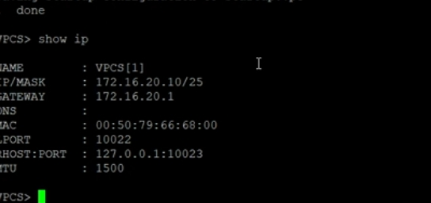{ #fig:002 width=75% }

ПК2 настроен в подсети 172.16.20.128/25 с адресом 172.16.20.138.  
Вывод IPv4 и IPv6 подтверждает корректность параметров.

{ #fig:003 width=75% }

Сервер получил адрес в сети 64.100.1.0/24.  
Вывод `show ip` демонстрирует корректную установку адреса и шлюза.

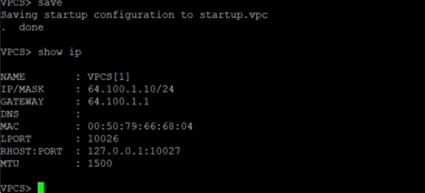{ #fig:004 width=75% }

На маршрутизаторе FRR выполнено назначение имени хоста и настройка трёх интерфейсов:

- eth0: 172.16.20.1/25  
- eth1: 172.16.20.129/25  
- eth2: 64.100.1.1/24  

Все интерфейсы были активированы.

{ #fig:005 width=80% }

Команда `show interface brief` показывает состояние и назначенные адреса.

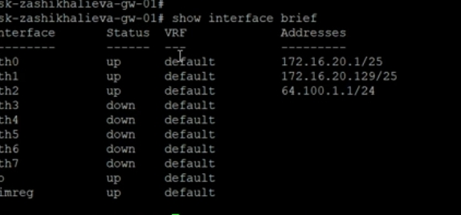{ #fig:007 width=70% }

PC1 успешно отправляет:

- ICMP-эхо-запросы на PC2 (172.16.20.138),
- ICMP-эхо-запросы на сервер (64.100.1.10).

Трассировка маршрута показывает прохождение трафика через FRR.

{ #fig:008 width=80% }

На линии между сервером и коммутатором был включён захват трафика.  
Фиксируются ARP-запросы, ICMP-эхо-запросы и ответы.

Пример успешного ответа сервера на эхо-запрос.

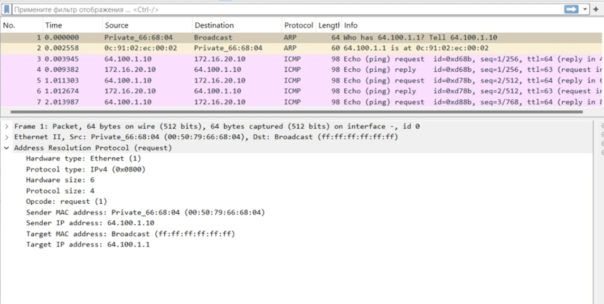{ #fig:010 width=90% }

В соответствии с таблицей 6.6 на узлы подсети IPv6 были назначены глобальные адреса.

Узлу PC3 назначен адрес из подсети `2001:db8:c0de:12::/64`.  
Команды `show ip` и `show ipv6` отображают отсутствие IPv4-конфигурации и наличие корректного глобального IPv6-адреса.

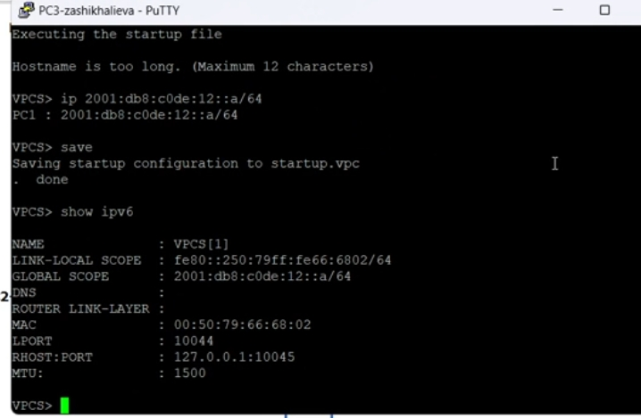{ #fig:011 width=75% }

ПК4 получил IPv6-адрес из подсети `2001:db8:c0de:13::/64`.  
Вывод показывает только IPv6-конфигурацию, аналогично PC3.

{ #fig:012 width=75% }

Сервер имеет два стека адресации:  
IPv4 — ранее настроена в подсети 64.100.1.0/24,  
IPv6 — адрес из подсети `2001:db8:c0de:11::/64`.

{ #fig:013 width=75% }

После установки VyOS и изменения имени хоста выполнялась настройка трёх интерфейсов маршрутизатора.  
Каждый интерфейс получил адрес и был включён в RA-сервис для автоматической раздачи префиксов.

{ #fig:014 width=85% }

После применения конфигурации был выполнен просмотр интерфейсов.

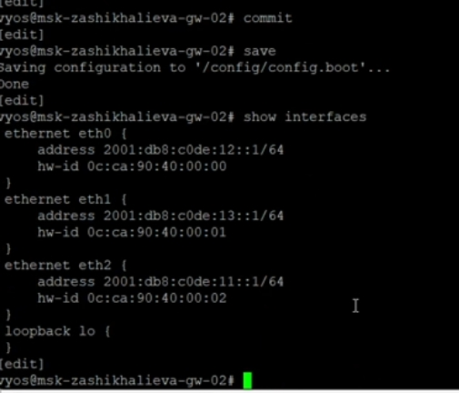{ #fig:015 width=70% }

PC4 успешно отправляет ICMPv6-эхо-запросы к узлам:

- PC3: `2001:db8:c0de:12::a`
- Server: `2001:db8:c0de:11::a`

При этом доступ к IPv4-адресам недоступен — что соответствует требованиям разделения подсетей.

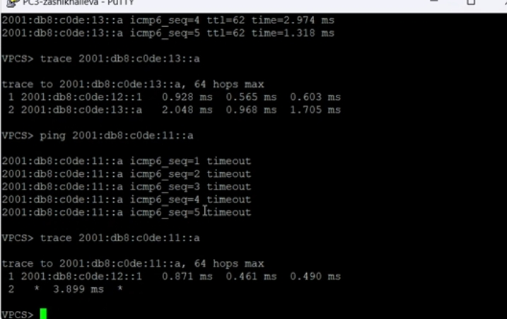{ #fig:016 width=80% }

Сервер успешно пингует узлы IPv6-сегмента и узлы IPv4-подсети.

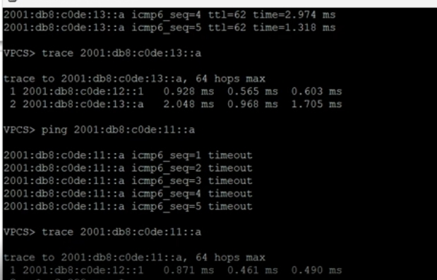{ #fig:017 width=75% }

На захваченном трафике видно:

- ICMPv6 Echo Request,
- ICMPv6 Echo Reply,
- Neighbor Solicitation/Advertisement.

Это подтверждает корректное функционирование IPv6 и SLAAC.

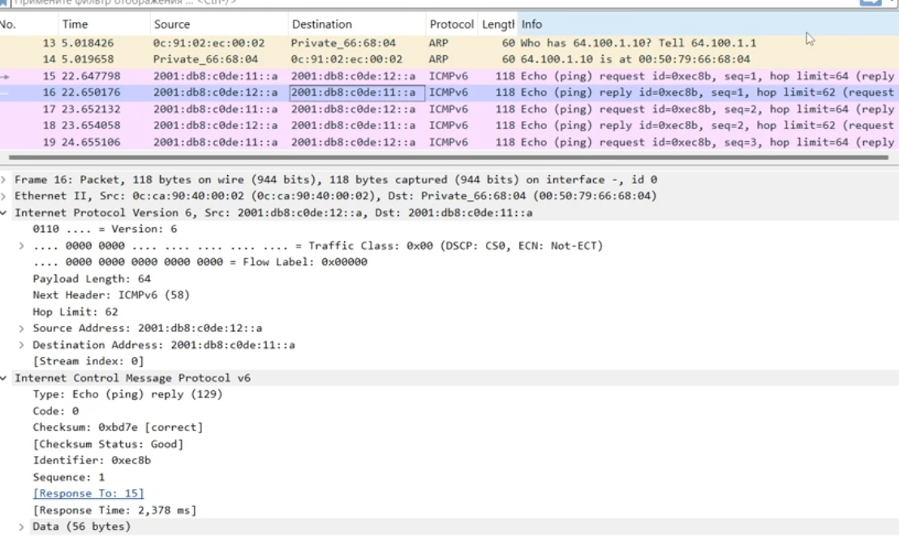{ #fig:018 width=90% }

## Задание для самостоятельного выполнения

Для топологии заданы две локальные подсети — каждая содержит как IPv4-, так и IPv6-адресное пространство.

Подсеть 1
- IPv4: **10.10.1.96/27**  
  Размер подсети — 32 адреса.  
  Диапазон:  
  • сеть: 10.10.1.96  
  • usable: 10.10.1.97 – 10.10.1.126  
  • broadcast: 10.10.1.127  

- IPv6: **2001:db8:1:1::/64**  
  Диапазон адресов: 2001:db8:1:1:: – 2001:db8:1:1:ffff:ffff:ffff:ffff  

Подсеть 2
- IPv4: **10.10.1.16/28**  
  Размер подсети — 16 адресов.  
  Диапазон:  
  • сеть: 10.10.1.16  
  • usable: 10.10.1.17 – 10.10.1.30  
  • broadcast: 10.10.1.31  

- IPv6: **2001:db8:1:4::/64**  
  Диапазон адресов: 2001:db8:1:4:: – 2001:db8:1:4:ffff:ffff:ffff:ffff  

Для интерфейсов маршрутизатора используются **минимальные доступные адреса**.

| Устройство | Интерфейс | IPv4-адрес | Маска | IPv6-адрес | Префикс |
|-----------|-----------|------------|--------|-------------|----------|
| msk-trseidaliev-gw-01 | eth0 | 10.10.1.97 | /27 | 2001:db8:1:1::1 | /64 |
| msk-trseidaliev-gw-01 | eth1 | 10.10.1.17 | /28 | 2001:db8:1:4::1 | /64 |
| PC1 | vpcs | 10.10.1.100 | /27 | 2001:db8:1:1::a | /64 |
| PC2 | vpcs | 10.10.1.20 | /28 | 2001:db8:1:4::a | /64 |

PC1 
Настроенные IPv4 и IPv6 отображаются в выводе:

{ #fig:019 width=75% }

Для PC2 настроены адреса второй подсети:

{ #fig:020 width=75% }

Используемая схема сети:

{ #fig:021 width=70% }

Маршрутизатор установлен и переведён в режим конфигурирования.  
Для каждого интерфейса заданы IPv4 и IPv6-адреса, соответствующие минимальным адресам подсети.

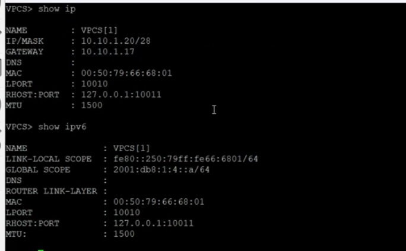{ #fig:022 width=80% }

PC1 успешно пингует:

- PC2 по IPv4: 10.10.1.20  
- PC2 по IPv6: 2001:db8:1:4::a  

Также выполнена трассировка маршрута.

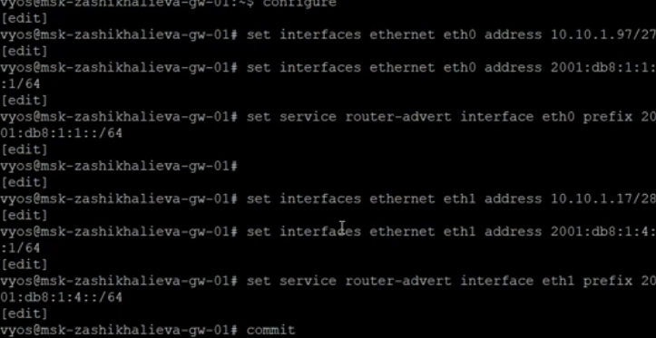{ #fig:023 width=80% }

Проверяются маршруты и ICMPv6-ответы.

{ #fig:024 width=85% }

# Заключение

В ходе выполнения работы:

- выполнено детальное разбиение IPv4- и IPv6-адресных пространств на подсети с расчётом масок, префиксов, диапазонов адресов и краевых значений;
- разработаны таблицы адресации для всех вариантов разбиения, включая выбор минимальных адресов для интерфейсов маршрутизаторов;
- настроены IPv4- и IPv6-адреса на конечных узлах и маршрутизаторах VyOS в соответствии с заданными топологиями;
- проверена работоспособность сетей с помощью утилит `ping` и `trace`, подтверждена корректность маршрутизации и изоляции подсетей;
- выполнен анализ трафика ICMPv4 и ICMPv6 в Wireshark, подтверждающий правильность функционирования адресного стека и соседских взаимодействий;
- обеспечена корректная работа двойного стека IPv4/IPv6, включая взаимодействие сервера с обеими подсетями и изоляцию сетей разного протокола.

Работа позволила закрепить навыки разбиения адресных пространств, настройки маршрутизаторов и анализа сетевого трафика в среде виртуального моделирования.
