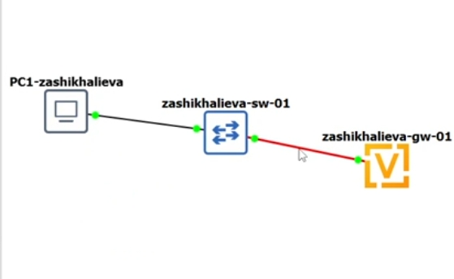
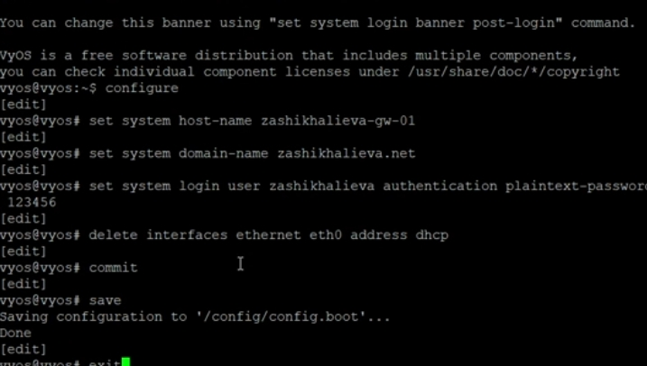
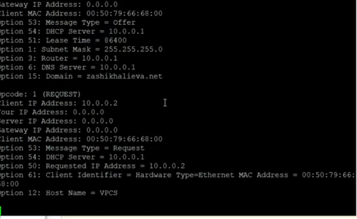
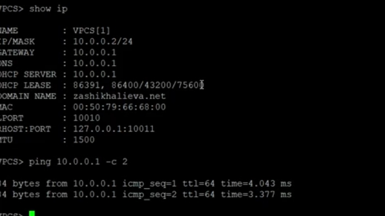
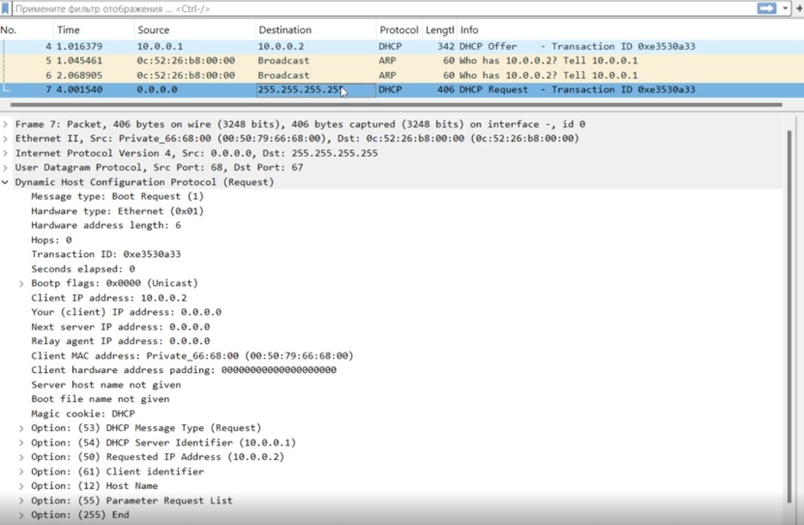
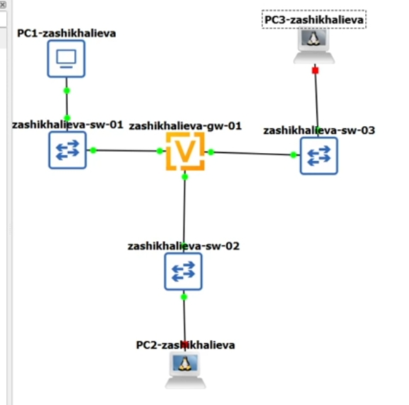
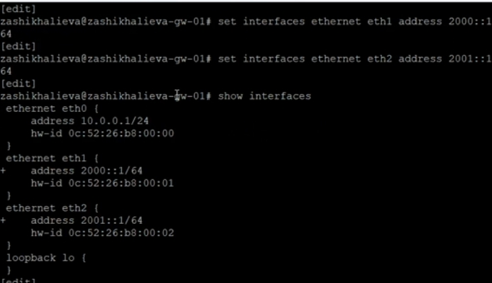
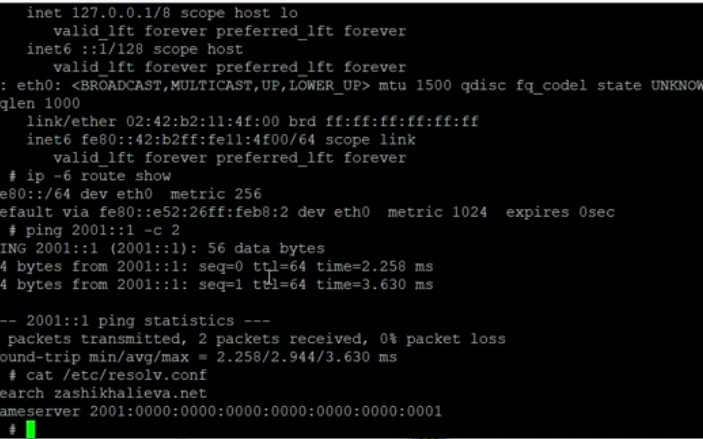

# Цель работы

## Основная цель

Получить навыки настройки DHCP, DHCPv6 Stateless и Stateful, SLAAC и IPv6-адресации в виртуальной среде GNS3.

# Выполнение работы 

## Топология IPv4

{ width=80% }

## Настройка VyOS

- Смена имени хоста и доменного имени  
- Создание нового пользователя  
- Назначение адреса 10.0.0.1/24  
- Настройка DHCP-сервера

{ width=70% }

## DHCP-сервер

- Подсеть: **10.0.0.0/24**  
- Диапазон: **10.0.0.2–10.0.0.253**  
- DNS: **10.0.0.1**  
- Домен: **trseidaliev.net**

{ width=75% }

## Клиент PC1

IP: 10.0.0.2/24  
Gateway: 10.0.0.1  
DNS: 10.0.0.1

{ width=75% }

## Проверка работы DHCP

{ width=70% }

## Последовательность обмена

- Discover  
- Offer  
- Request  
- ACK

{ width=100% }

## Новая расширенная топология

{ width=80% }

## Настройка адресов IPv6

- eth1 → 2000::1/64  
- eth2 → 2001::1/64  

{ width=70% }

## Router Advertisement (RA)

- Префикс 2000::/64  
- other-config-flag: получение DNS через DHCPv6

{ width=80% }

## DHCPv6 Stateless

Параметры выдаются:  
- DNS: 2000::1  
- Domain-search: trseidaliev.net

{ width=75% }

## Клиент PC2 (SLAAC)

Адрес: SLAAC (2000::/64)  
Маршруты добавлены автоматически

{ width=80% }

## DHCPv6 Stateless: получение DNS

{ width=80% }

## Анализ DHCPv6 Stateless

{ width=100% }

## Включение режима Stateful

- RA: managed-flag  
- Диапазон адресов: **2001::100 – 2001::199**  
- DNS: 2001::1  
- Domain-search: trseidaliev.net

{ width=80% }

## PC3 — до получения адреса

{ width=75% }

## PC3 — получение адреса DHCPv6 Stateful

{ width=80% }

## PC3 — после получения адреса

Полная конфигурация:  
- IPv6: 2001::198 или 2001::199  
- DNS: 2001::1  
- Пинг до 2001::1 успешен

{ width=80% }

## Просмотр аренд DHCPv6 Stateful

{ width=75% }

## Пакеты Solicit, Advertise, Request, Reply

{ width=100% }

# Итоги

## Основные достижения

- Настроен DHCP для IPv4  
- Настроены SLAAC, DHCPv6 Stateless и Stateful  
- Выполнена полная проверка маршрутизации и связности  
- Проанализирован сетевой трафик всех DHCP-механизмов  
- Подтверждена корректная работа всех служб распределения адресов
