# Цель работы

## Основная цель

Изучить принципы адресации и маршрутизации в сетях IPv4 и IPv6, а также механизм организации туннеля IPv6 поверх IPv4 с использованием маршрутизаторов VyOS и среды моделирования GNS3.

# Исходная топология

## Общая схема сети

- Две изолированные IPv6-сети  
- Транзитная IPv4-сеть между ними  
- Три маршрутизатора VyOS  
- Два оконечных узла VPCS  

{ width=80% }

# Адресация IPv6 на оконечных узлах

## Настройка PC1

- IPv6-адрес: **1000::a/64**
- Автоматическое получение шлюза через Router Advertisement
- Проверка параметров IPv6

{ width=70% }

## Настройка PC2

- IPv6-адрес: **1002::a/64**
- Получение link-local и глобального адресов
- Проверка конфигурации

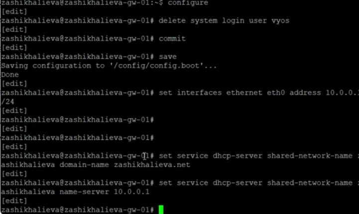{ width=70% }

# Настройка граничных маршрутизаторов

## Маршрутизатор msk-zashikhalieva-gw-01

- IPv6: **1000::1/64** (локальная сеть PC1)
- IPv4: **10.0.0.1/8**
- Включение Router Advertisement

{ width=75% }

## Маршрутизатор msk-zashikhalieva-gw-02

- IPv6: **1002::1/64** (локальная сеть PC2)
- IPv4: **20.0.0.2/8**
- Включение Router Advertisement

{ width=75% }

## Транзитный маршрутизатор msk-zashikhalieva-gw-03

- IPv4: **10.0.0.2/8** и **20.0.0.1/8**
- Обеспечение связи между IPv4-сетями

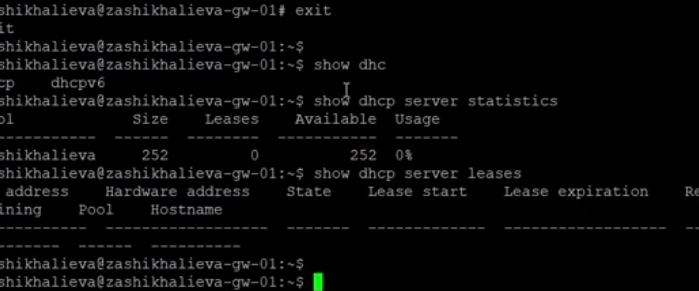{ width=75% }

# Проверка IPv4-связности (до маршрутизации)

## Результаты проверки

- Доступна сеть **10.0.0.0/8**
- Сеть **20.0.0.0/8** недостижима
- Причина — отсутствие маршрутов

{ width=80% }

# Динамическая маршрутизация IPv4 (RIP)

## Настройка RIP

- gw-01: сеть **10.0.0.0/8**

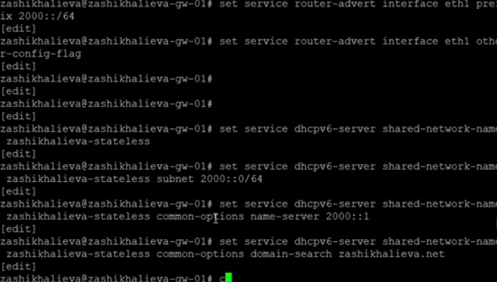{ width=70% }

## Настройка RIP

- gw-02: сеть **20.0.0.0/8**

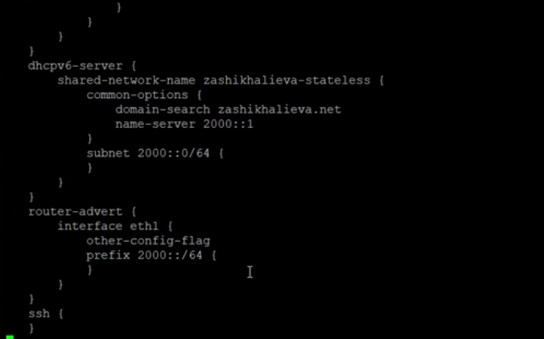{ width=70% }

## Настройка RIP

- gw-03: обе сети

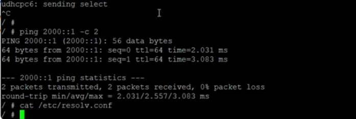{ width=70% }

## Проверка связности после RIP

- Все IPv4-узлы доступны
- Маршруты распространяются автоматически

{ width=80% }

# Анализ IPv4-трафика

## RIP и ICMP

- RIP-пакеты на **224.0.0.9**
- ICMP Echo Request / Reply между сетями

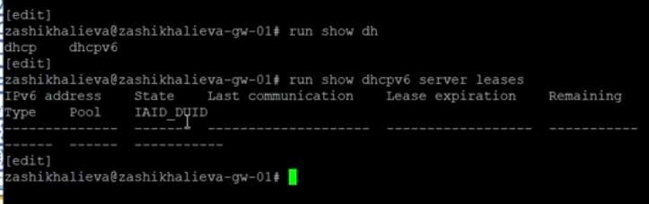{ width=90% }

# Туннелирование IPv6 поверх IPv4

## Создание туннеля 6in4

- Тип туннеля: **SIT**
- gw-01 ↔ gw-02

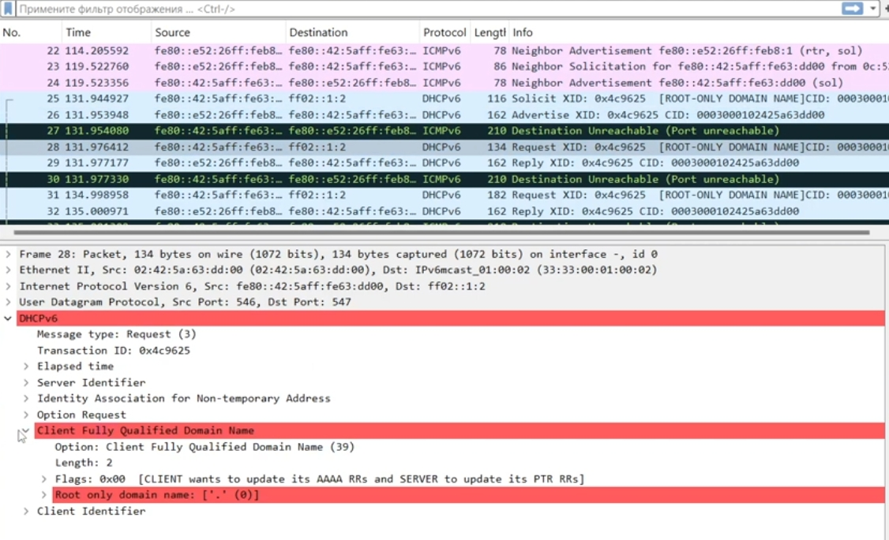{ width=80% }

## Создание туннеля 6in4

- IPv6-сеть туннеля: **1001::/64**

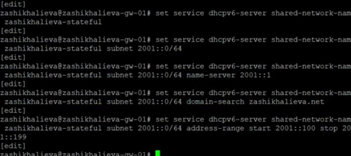{ width=80% }

# Статическая маршрутизация IPv6

## Настройка маршрутов

- gw-01 → **1002::/64** через **1001::2**

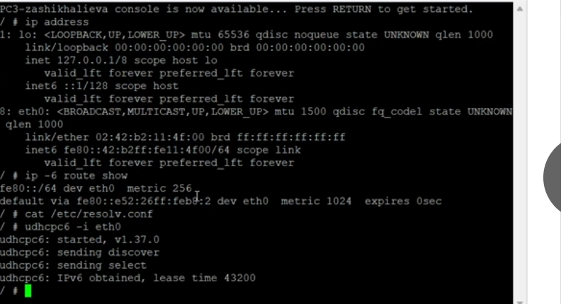{ width=75% }

## Настройка маршрутов

- gw-02 → **1000::/64** через **1001::1**

{ width=75% }

# Проверка IPv6-доступности

## PC1 → PC2

- Ping успешен
- Traceroute проходит через туннель

{ width=80% }

## PC2 → PC1

- Двусторонняя IPv6-связность
- Корректная маршрутизация

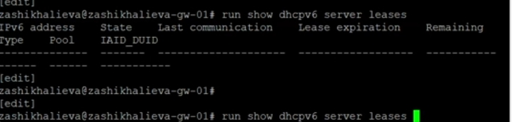{ width=80% }

# Анализ туннельного трафика

## IPv6 внутри IPv4

- IPv4-пакеты с **protocol = 41**
- Внутри — ICMPv6
- Адреса 1000::a ↔ 1002::a

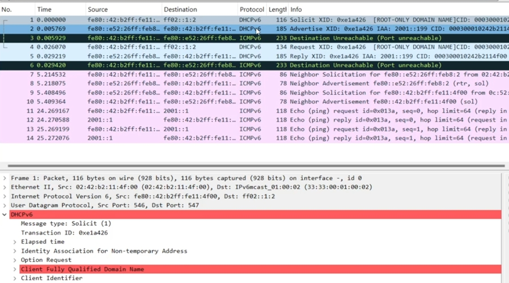{ width=90% }

# Итоги работы

## Основные результаты

- Построена модель сети IPv4/IPv6 в GNS3  
- Настроена адресация IPv6 и IPv4  
- Реализована динамическая маршрутизация IPv4 (RIP)  
- Создан туннель IPv6 поверх IPv4 (6in4)  
- Настроена статическая маршрутизация IPv6  
- Подтверждена работоспособность сети и туннеля  
- Проанализирована инкапсуляция IPv6-трафика в IPv4  

