# Цель работы

Изучение принципов маршрутизации в IPv4- и IPv6-сетях и принципов настройки сетевого оборудования.

# Выполнение

## Построение туннеля IPv6–IPv4

В среде моделирования GNS3 был создан новый проект для построения топологии с двумя IPv6-сетями и транзитной IPv4-сетью между ними. В рабочем пространстве размещены два хоста VPCS (PC1-zashikhalieva и PC2-zashikhalieva), два Ethernet-коммутатора (msk-zashikhalieva-sw-01 и msk-zashikhalieva-sw-02), а также три маршрутизатора VyOS (msk-zashikhalieva-gw-01, msk-zashikhalieva-gw-02 и msk-zashikhalieva-gw-03). Соединения выполнены в соответствии с заданной схемой: PC1 подключён к sw-01, далее связь идёт на gw-01; gw-01 соединён с gw-03 по IPv4-сегменту 10.0.0.0/8; gw-03 соединён с gw-02 по IPv4-сегменту 20.0.0.0/8; gw-02 подключён к sw-02, к которому подключён PC2. На линке между gw-01 и gw-03 был подключён анализатор трафика для последующего просмотра ICMP/IPv4 пакетов и дальнейшего контроля инкапсуляции 6in4.

Итоговая топология сети приведена на рисунке:

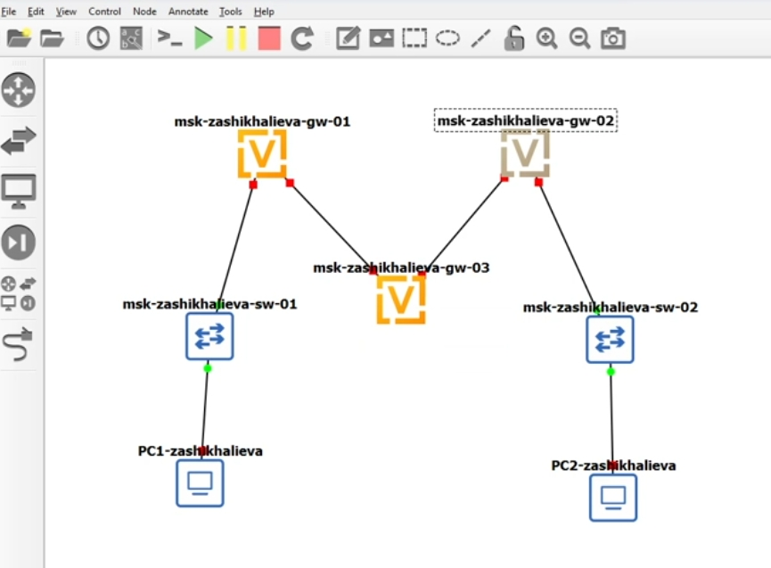{ #fig:001 width=85% }

Далее выполнена адресация устройств согласно таблице адресации из задания: PC1 получил IPv6-адрес из сети 1000::/64, PC2 — из сети 1002::/64. Маршрутизаторы gw-01 и gw-02 настроены как граничные устройства своих IPv6-сегментов, а gw-03 используется как транзитный IPv4-маршрутизатор между двумя IPv4-подсетями. Дополнительно на gw-01 и gw-02 включена рассылка Router Advertisement, чтобы ПК могли корректно определять ближайший маршрутизатор (шлюз в терминах локального сегмента IPv6) и параметры соседства через NDP.

### Настройка адресации на узлах и маршрутизаторах, проверка связности и анализ трафика

Сначала была выполнена настройка IPv6 на VPCS-хостах. На PC1-zashikhalieva назначен глобальный IPv6-адрес `1000::a/64`, после чего конфигурация сохранена и параметры проверены командой просмотра IPv6. В выводе присутствует link-local адрес и глобальный адрес, что подтверждает успешное назначение:

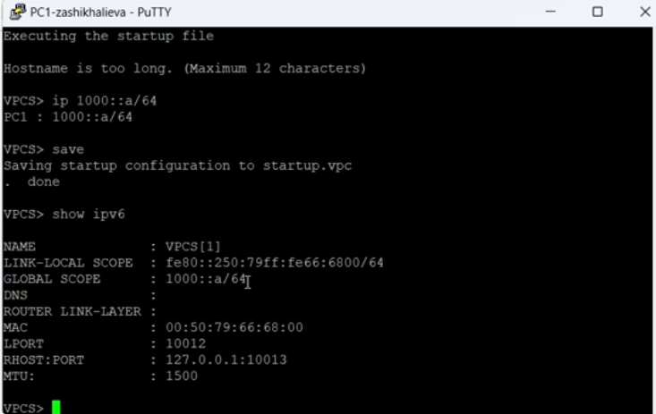{ #fig:002 width=75% }

На PC2-zashikhalieva выполнены аналогичные действия: назначен IPv6-адрес `1002::a/64`, конфигурация сохранена и проверена. Вывод также подтверждает корректность назначения адреса и наличие link-local адреса:

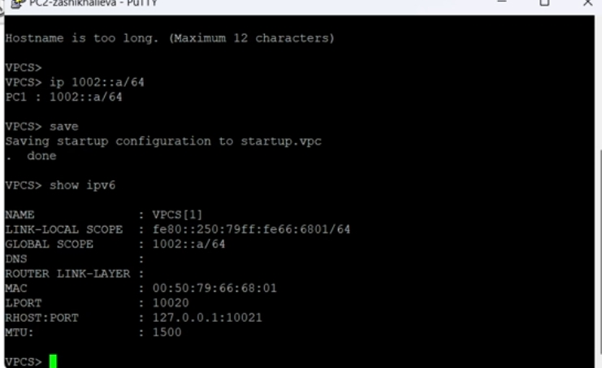{ #fig:003 width=75% }

Затем выполнена настройка граничных маршрутизаторов. На msk-zashikhalieva-gw-01 интерфейсу eth0 назначен IPv6-адрес `1000::1/64` для подключения к локальной IPv6-сети PC1, а интерфейсу eth1 назначен IPv4-адрес `10.0.0.1/8` для связи с транзитным маршрутизатором. Для локального сегмента включена рассылка Router Advertisement с префиксом `1000::/64`, что позволяет хостам корректно узнавать параметры сети и ближайший маршрутизатор на канальном уровне (через NDP):

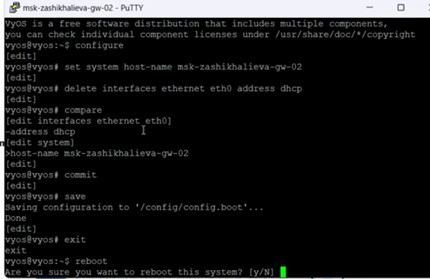{ #fig:004 width=80% }

На msk-zashikhalieva-gw-02 интерфейсу eth0 назначен IPv6-адрес `1002::1/64` для локальной IPv6-сети PC2, а eth1 получил IPv4-адрес `20.0.0.2/8` для связи с транзитным маршрутизатором. Аналогично включён Router Advertisement с префиксом `1002::/64`:

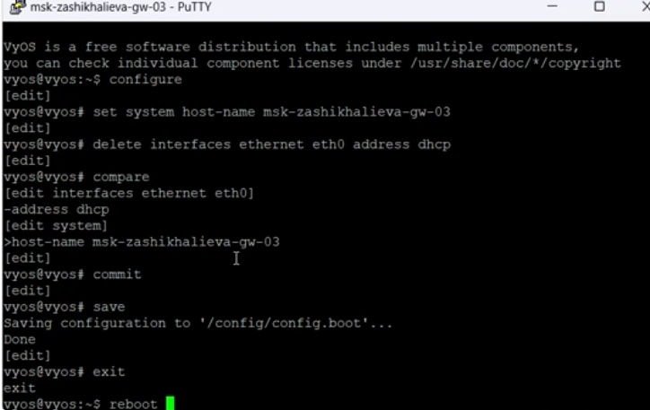{ #fig:005 width=80% }

Транзитный маршрутизатор msk-zashikhalieva-gw-03 настроен только на уровне IPv4. На eth0 назначен адрес `10.0.0.2/8`, на eth1 — адрес `20.0.0.1/8`. Это обеспечивает возможность маршрутизации между двумя IPv4-сегментами при наличии соответствующих маршрутов на крайних маршрутизаторах, однако на данном этапе в конфигурации отсутствуют дополнительные правила маршрутизации и/или туннельная логика:

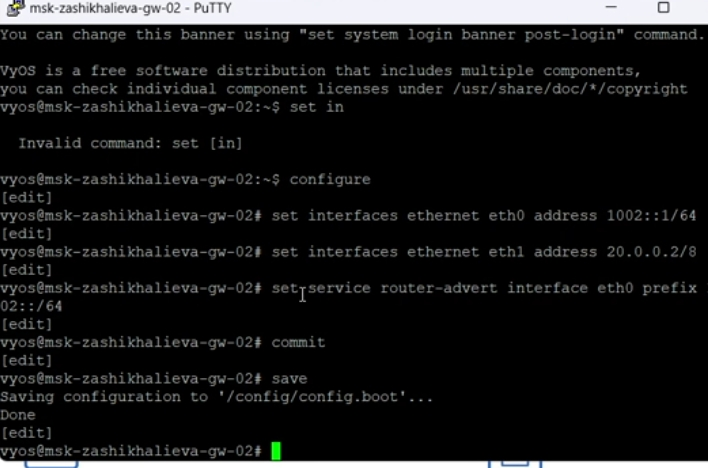{ #fig:006 width=80% }

После настройки маршрутизаторов была выполнена проверка, что на ПК появились параметры ближайших маршрутизаторов. На PC1 в выводе `show ipv6` отображается Router Link-Layer и служебная информация соседства, что указывает на корректную работу NDP и получение данных о маршрутизаторе в своём сегменте:

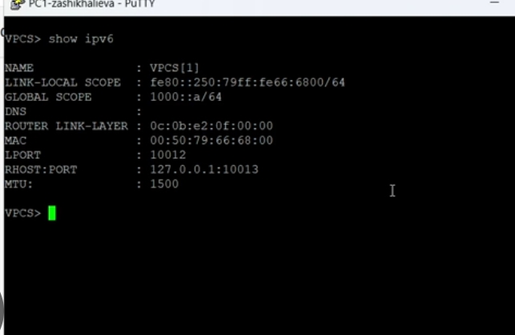{ #fig:007 width=75% }

Далее согласно заданию выполнены проверки маршрутов и связности с маршрутизатора R1 (msk-zashikhalieva-gw-01). Проверка `ping 10.0.0.2` успешна, так как это адрес транзитного маршрутизатора gw-03 в той же IPv4-сети 10.0.0.0/8. При попытках `ping 20.0.0.1` и `ping 20.0.0.2` получен результат `Network is unreachable`. Такой результат объясняется тем, что на gw-01 отсутствует маршрут к сети 20.0.0.0/8: gw-01 видит только непосредственно подключённую сеть 10.0.0.0/8, а статические маршруты или динамическая маршрутизация для достижения 20.0.0.0/8 не настроены. Следовательно, пакетам некуда отправляться, и узел корректно сообщает о недостижимости сети.

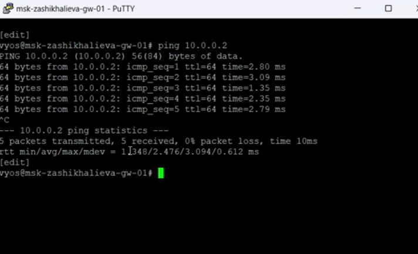{ #fig:009 width=80% }

Для подтверждения поведения сети был рассмотрен захват трафика. В анализаторе наблюдаются ICMP Echo Request/Echo Reply пакеты между 10.0.0.1 и 10.0.0.2, что соответствует успешному ping внутри IPv4-сегмента. Пакеты имеют стандартную структуру ICMP поверх IPv4. На данном этапе трафик 6in4 ещё не сформирован, однако в дальнейшем при организации IPv6-over-IPv4 туннеля передача IPv6 будет идти внутри IPv4-пакетов с номером протокола 41, а накладные расходы инкапсуляции будут составлять 20 байт заголовка IPv4 (что важно учитывать относительно MTU: при 1500 байт IPv6-пакеты до 1480 байт могут передаваться без фрагментации).

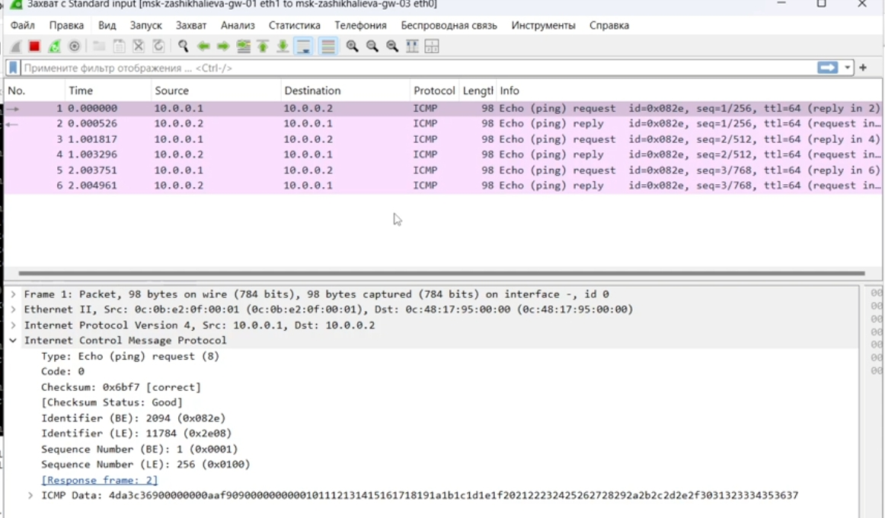{ #fig:010 width=90% }

### Настройка динамической маршрутизации IPv4 (RIP) и повторная проверка связности

После первичной проверки было установлено, что с маршрутизатора msk-zashikhalieva-gw-01 доступны только узлы в сети 10.0.0.0/8, тогда как адреса из сети 20.0.0.0/8 определялись как недостижимые. Такое поведение является ожидаемым, поскольку на предыдущем этапе в сети отсутствовали маршруты между IPv4-подсетями. Для обеспечения автоматического обмена маршрутной информацией между маршрутизаторами была настроена динамическая маршрутизация с использованием протокола RIP.

На маршрутизаторе msk-zashikhalieva-gw-01 был включён RIP для сети 10.0.0.0/8. После применения и сохранения конфигурации маршрутизатор начал рассылать RIP-объявления в своей IPv4-сети:

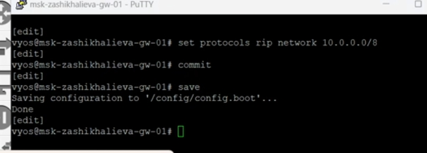{ #fig:011 width=80% }

На транзитном маршрутизаторе msk-zashikhalieva-gw-03 протокол RIP уже был активен для сети 20.0.0.0/8, поэтому дополнительно была включена поддержка сети 10.0.0.0/8. Таким образом, gw-03 стал участвовать в обмене маршрутами между обеими IPv4-подсетями, выполняя роль промежуточного маршрутизатора:

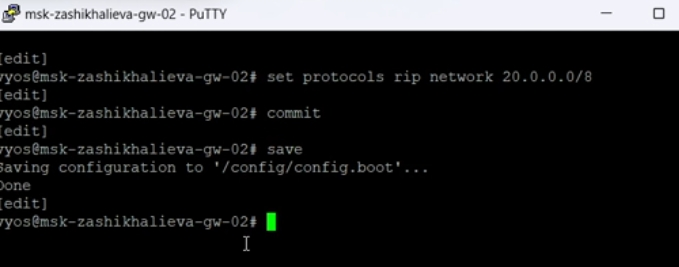{ #fig:012 width=80% }

На маршрутизаторе msk-zashikhalieva-gw-02 был включён RIP для сети 20.0.0.0/8. После применения настроек данный маршрутизатор начал принимать маршруты от gw-03 и анонсировать свою подключённую сеть:

{ #fig:013 width=80% }

После завершения настройки динамической маршрутизации была повторно выполнена проверка связности с маршрутизатора msk-trseidaliev-gw-01. Проверка доступности узла 10.0.0.2 по-прежнему завершается успешно, что подтверждает корректную работу ранее настроенного соединения. В отличие от предыдущего этапа, проверки доступности адресов 20.0.0.1 и 20.0.0.2 также завершаются успешно, что свидетельствует о появлении маршрутов к сети 20.0.0.0/8, полученных по протоколу RIP:

{ #fig:014 width=85% }

Для подтверждения корректной работы динамической маршрутизации и обмена маршрутной информацией был выполнен анализ трафика. В захвате пакетов наблюдаются RIP-сообщения, передаваемые на multicast-адрес 224.0.0.9, а также ICMP Echo Request и Echo Reply между узлами сетей 10.0.0.0/8 и 20.0.0.0/8. Это подтверждает, что маршрутизаторы успешно обменялись маршрутами и начали корректно пересылать пользовательский трафик между ранее недоступными сегментами:

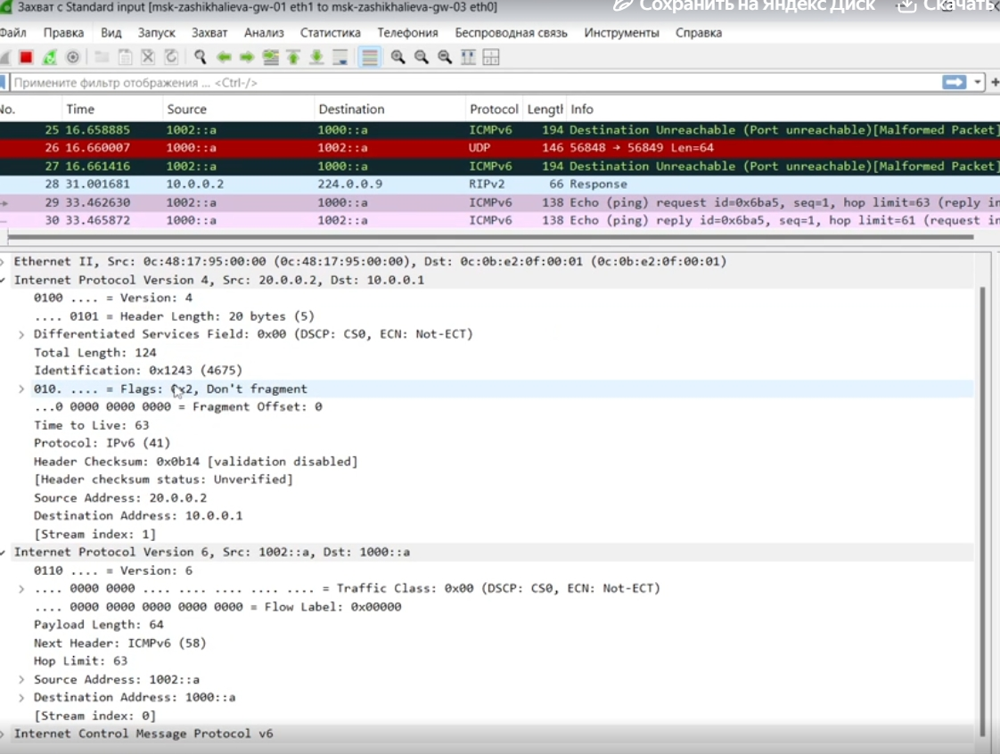{ #fig:015 width=90% }

### Создание туннеля IPv6 поверх IPv4 и проверка межсетевого взаимодействия

После настройки динамической маршрутизации IPv4 и обеспечения полной связности между сетями 10.0.0.0/8 и 20.0.0.0/8 была выполнена организация туннеля IPv6 поверх IPv4 (6in4). Цель данного этапа — обеспечить передачу IPv6-трафика между двумя изолированными IPv6-сетями через уже настроенную IPv4-инфраструктуру.

На маршрутизаторе msk-zashikhalieva-gw-01 был создан туннельный интерфейс tun0 с типом инкапсуляции SIT. В качестве исходного IPv4-адреса указан адрес интерфейса eth1 (10.0.0.1), а в качестве удалённого адреса — IPv4-адрес маршрутизатора msk-trseidaliev-gw-02 (20.0.0.2). Самому туннельному интерфейсу был назначен IPv6-адрес 1001::1/64. После применения и сохранения конфигурации туннель стал логически доступен на уровне IPv6:

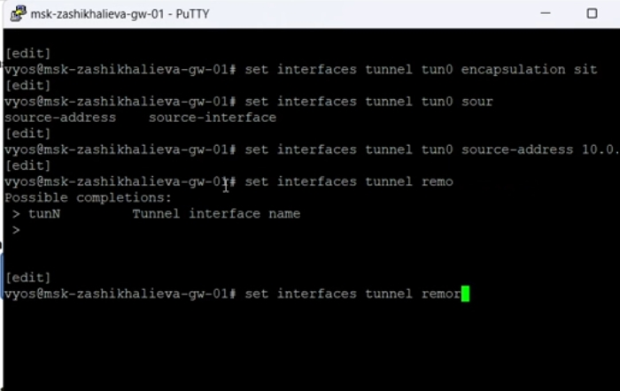{ #fig:016 width=85% }

Аналогичная настройка выполнена на маршрутизаторе msk-trseidaliev-gw-02. Здесь туннель tun0 также использует инкапсуляцию SIT, но с зеркально заданными параметрами: источником выступает IPv4-адрес 20.0.0.2, а удалённым узлом — 10.0.0.1. IPv6-адрес туннеля задан как 1001::2/64. Таким образом, между маршрутизаторами gw-01 и gw-02 сформирован логический IPv6-канал поверх IPv4-сети:

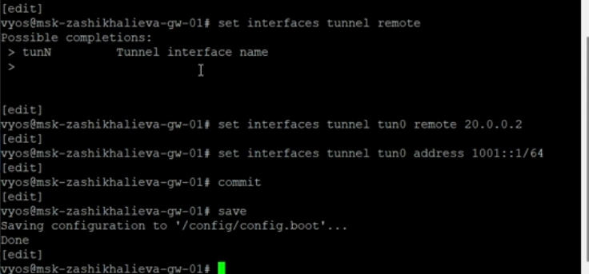{ #fig:017 width=85% }

Для обеспечения маршрутизации IPv6-трафика между оконечными сетями были добавлены статические маршруты. На msk-zashikhalieva-gw-01 настроен маршрут к сети 1002::/64 с указанием следующего узла 1001::2 (туннельный адрес gw-02). На msk-trseidaliev-gw-02, в свою очередь, добавлен маршрут к сети 1000::/64 с next-hop 1001::1. Эти маршруты направляют весь межсетевой IPv6-трафик через созданный туннель:

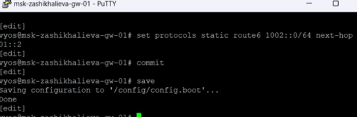{ #fig:018 width=80% }

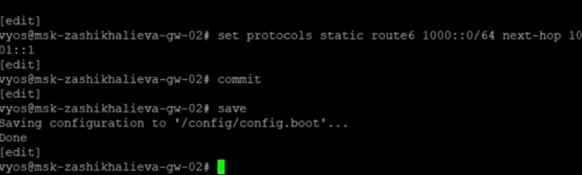{ #fig:019 width=80% }

После завершения настройки была выполнена проверка доступности оконечных узлов. С хоста PC1-zashikhalieva успешно выполнен ping до IPv6-адреса PC2 (1002::a). Все ICMPv6 Echo Reply получены без потерь, что подтверждает корректную маршрутизацию IPv6 через туннель. Команда trace также показала прохождение пакетов сначала через локальный маршрутизатор (1000::1), затем через туннельные адреса (1001::1 и 1001::2), и далее до конечного узла:

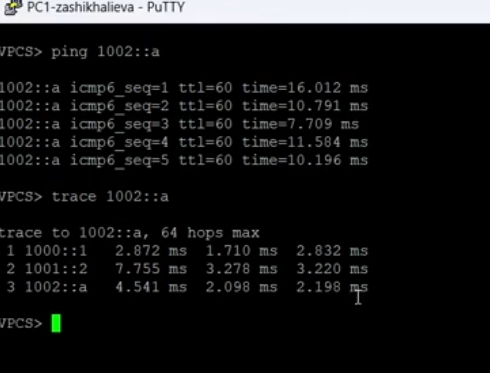{ #fig:020 width=85% }

Аналогичная проверка выполнена в обратном направлении. С хоста PC2-zashikhalieva успешно выполнен ping до IPv6-адреса PC1 (1000::a), а трассировка маршрута подтверждает симметричное прохождение трафика через туннель между gw-02 и gw-01:

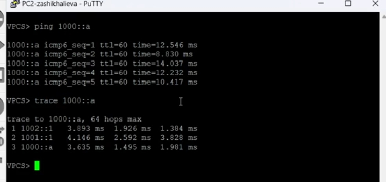{ #fig:021 width=85% }

Для детального анализа механизма работы туннеля был изучен захват трафика на IPv4-соединении между маршрутизаторами gw-01 и gw-03. В анализаторе отчётливо видны IPv4-пакеты с номером протокола 41, что указывает на использование механизма IPv6-in-IPv4. Внутри полезной нагрузки этих пакетов содержатся полноценные IPv6-пакеты, включая ICMPv6 Echo Request и Echo Reply, адресованные узлам 1000::a и 1002::a:

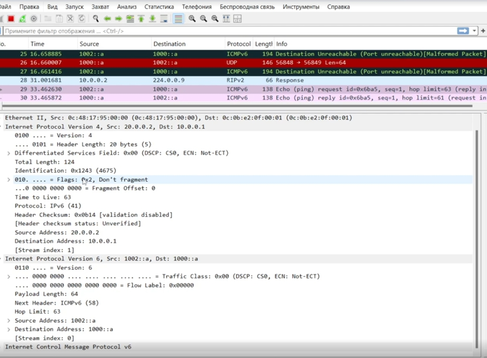{ #fig:022 width=90% }

# Заключение

В ходе выполненной лабораторной работы была последовательно реализована и исследована модель сети с двумя изолированными IPv6-сегментами, связанными между собой через транзитную IPv4-сеть с использованием механизма туннелирования IPv6 поверх IPv4 (6in4).

В процессе выполнения работы:

- была создана и корректно оформлена топология сети в среде GNS3, включающая два оконечных узла VPCS, два Ethernet-коммутатора и три маршрутизатора VyOS, выполняющих функции граничных и транзитного маршрутизаторов;
- выполнена настройка IPv6-адресации на оконечных узлах PC1 и PC2 в соответствии с заданной таблицей адресации, а также проверено наличие link-local и глобальных IPv6-адресов;
- произведена конфигурация интерфейсов маршрутизаторов VyOS, включающая назначение IPv6-адресов для локальных сегментов, IPv4-адресов для транзитной сети и настройку рассылки Router Advertisement для автоматического обнаружения шлюза узлами;
- реализована динамическая маршрутизация IPv4 с использованием протокола RIP, что обеспечило автоматическое распространение маршрутов между сетями 10.0.0.0/8 и 20.0.0.0/8 и устранило проблему недостижимости удалённых IPv4-узлов;
- выполнена настройка туннеля IPv6 поверх IPv4 (SIT) между граничными маршрутизаторами, включая назначение IPv6-адресов туннельным интерфейсам и конфигурацию статической маршрутизации IPv6 для направленной передачи трафика между сетями 1000::/64 и 1002::/64;
- проведена проверка доступности оконечных узлов с использованием ICMPv6, а также трассировка маршрутов, подтвердившая прохождение пакетов через туннельные интерфейсы;
- выполнен анализ сетевого трафика с использованием анализатора пакетов, в ходе которого зафиксированы IPv4-пакеты с номером протокола 41, содержащие инкапсулированные IPv6-пакеты, что наглядно подтвердило работу механизма 6in4;
- изучена структура инкапсуляции IPv6-трафика в IPv4, включая соответствие адресов источника и назначения на обоих уровнях и влияние инкапсуляции на размер полезной нагрузки с учётом MTU.

В результате работы были закреплены практические навыки настройки адресации IPv4 и IPv6, динамической и статической маршрутизации в VyOS, организации туннелей IPv6 поверх IPv4, а также умения анализа сетевого трафика и интерпретации данных инкапсуляции. Полученные результаты подтверждают корректную работу настроенной сети и соответствие её поведения теоретическим принципам функционирования протоколов IPv4, IPv6 и механизмов туннелирования.
